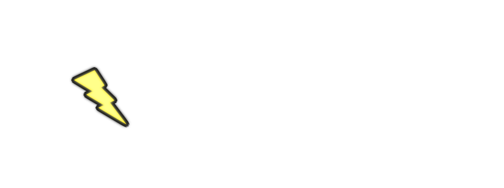

# YoloBox Image Labeler

YoloBox is a powerful WPF-based YOLO image labeling tool designed for object detection training datasets. It provides an intuitive way to validate images before labeling, and makes it easy to draw, modify, and manage label boxes on images. It is made primarily for me, but it is tailored for general high-efficiency workflows, so hopefully it is as helpful to you as it is to me!

## 🚀 Features

- Quick Data Validation (drop in a folder of images, and pick which ones you want to exclude)
- Automatically export just the images you want into a new folder for labeling
- Quickly generate a YOLO-friendly dataset folder structure
- Class and label management
- Auto-Saves labels in YOLO format
- Resizable/adjustable bounding boxes
- Fast image loading and navigation
- Dark theme UI for comfortable long labeling sessions
- Keyboard navigation and shortcut support
- Custom key-bindings for quick class selection changes

## 🛠️ Getting Started

### Prerequisites

- [.NET 8](https://dotnet.microsoft.com/download) or higher
- Visual Studio 2022 or later

### Build and Run

1. Clone the repository:
   ```bash
   git clone https://github.com/billydanke/YoloBox.git
   ```
2. Open the solution in Visual Studio.
3. Build and run the project.

## 📸 Screenshots

### Image Validation on Coco128 Dataset


### Image Labeling on Coco128 Dataset


## 🤝 Contributing
Pull requests are welcome! I'm not going to pretend to be the best WPF developer, so if you find anything you would like to change or fix feel free, and maybe it will end up in the master branch. For major changes, please open an issue first to discuss what you'd like to change.

## 📝 License
This project is under MIT License. See LICENSE for more information.